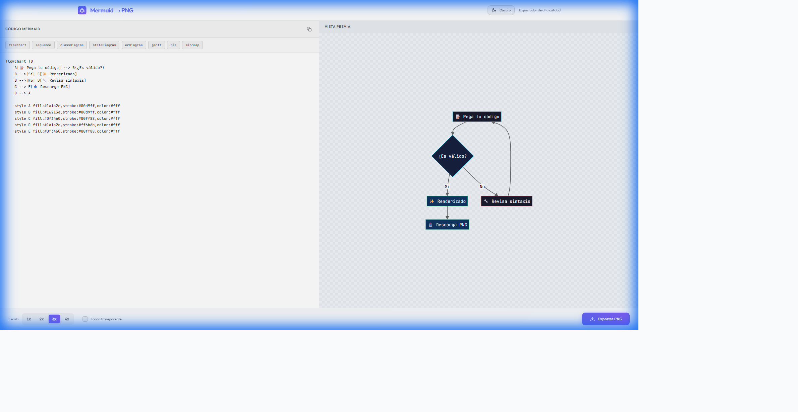
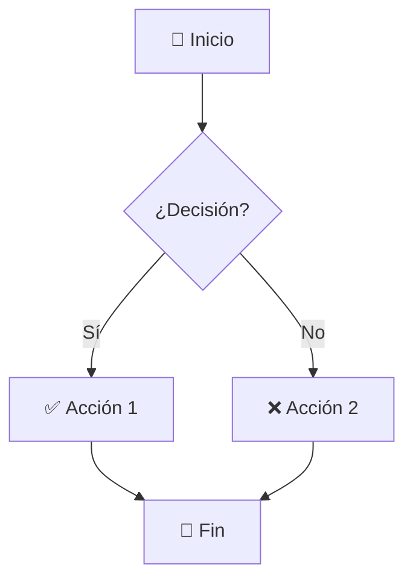

<div align="center">

# 🧜‍♀️ Mermaid → PNG Exporter

**Exporta diagramas Mermaid a PNG de alta calidad con un solo clic**

[](https://react.dev/)
[](https://vitejs.dev/)
[](https://mermaid.js.org/)
[](https://web.dev/progressive-web-apps/)
[](LICENSE)

[Demo en Vivo](https://mermaid-png-exporter.vercel.app) • [Características](#-características) • [Instalación](#-instalación) • [Uso](#-uso-rápido) • [Contribuir](#-contribuir)

---



</div>

## ✨ Características

### 🎯 Exportación de Alta Calidad
- **Escalas múltiples**: Exporta en 1x, 2x, 3x o 4x para diferentes necesidades
- **Fondo transparente**: Opción para exportar con fondo transparente (ideal para presentaciones)
- **Renderizado preciso**: Estilos inline garantizan fidelidad visual en cualquier contexto

### 🔧 Editor Inteligente
- **Renderizado en tiempo real**: Ve los cambios al instante mientras escribes
- **Auto-corrección de sintaxis**: Sistema avanzado que detecta y corrige errores comunes de Mermaid automáticamente
  - Paréntesis sin entrecomillar en nodos y subgraphs
  - Bug conocido de colores hex en `linkStyle`
  - Caracteres especiales problemáticos
- **Validación instantánea**: Mensajes de error claros con sugerencias de corrección

### 📊 8 Tipos de Diagramas Soportados
| Diagrama | Descripción |
|----------|-------------|
| 📈 **Flowchart** | Diagramas de flujo con múltiples formas y estilos |
| 🔄 **Sequence** | Diagramas de secuencia para interacciones |
| 🏗️ **Class** | Diagramas UML de clases |
| 🔀 **State** | Máquinas de estados con subestados |
| 🗄️ **Entity Relationship** | Modelos de base de datos |
| 📅 **Gantt** | Cronogramas y planificación de proyectos |
| 🥧 **Pie** | Gráficos circulares con datos |
| 🧠 **Mind Map** | Mapas mentales jerárquicos |

### 🎨 Experiencia de Usuario Premium
- **Tema claro/oscuro**: Cambia según tu preferencia o detecta automáticamente
- **Diseño responsive**: Optimizado para móvil, tablet y escritorio
- **Plantillas incluidas**: 8 ejemplos listos para usar como punto de partida

### 📱 Progressive Web App (PWA)
- **Funciona offline**: Usa la app sin conexión a internet
- **Instalable**: Añádela a tu pantalla de inicio como app nativa
- **Actualizaciones automáticas**: Siempre la última versión disponible

### 💻 Ejecutable Standalone (Windows)
- **Sin instalación**: Descarga y ejecuta directamente
- **Sin dependencias**: No requiere Node.js ni npm instalado
- **Auto-abre navegador**: Se inicia automáticamente en tu navegador por defecto

---

## 🚀 Instalación

### Opción 1: Ejecutable Windows (Recomendado para usuarios)

1. Descarga `MermaidExporter.exe` desde [Releases](../../releases)
2. Haz doble clic para ejecutar
3. La aplicación se abrirá automáticamente en tu navegador

> 📦 **Tamaño**: ~38 MB | No requiere instalación ni dependencias

### Opción 2: Desarrollo Local

```bash
# Clonar el repositorio
git clone https://github.com/pma1999/mermaid-png-exporter.git
cd mermaid-png-exporter

# Instalar dependencias
npm install

# Iniciar servidor de desarrollo
npm run dev
```

La aplicación estará disponible en `http://localhost:3000`

### Opción 3: Despliegue en Vercel

[](https://vercel.com/new/clone?repository-url=https://github.com/pma1999/mermaid-png-exporter)

El proyecto incluye configuración lista para Vercel con:
- Headers de seguridad (`X-Content-Type-Options`, `X-Frame-Options`, `X-XSS-Protection`)
- Caché optimizado para Service Worker
- SPA routing configurado

---

## 📖 Uso Rápido

### 1. Escribe o pega tu código Mermaid



### 2. Configura la exportación

| Opción | Descripción |
|--------|-------------|
| **Escala** | 1x (web), 2x (retina), 3x (print), 4x (poster) |
| **Fondo** | Blanco o transparente |

### 3. Descarga tu PNG

Haz clic en el botón **"Descargar PNG"** y listo.

---

## 🛠️ Desarrollo

### Scripts disponibles

```bash
npm run dev      # Servidor de desarrollo con HMR
npm run build    # Build de producción
npm run preview  # Vista previa del build
```

### Generar ejecutable Windows

```powershell
.\build-exe.ps1
```

Esto genera `release/MermaidExporter.exe` con:
- Build de producción de Vite
- Servidor Express embebido
- Empaquetado con [pkg](https://github.com/vercel/pkg)

### Estructura del proyecto

```
mermaid-png-exporter/
├── src/
│   ├── components/         # Componentes React
│   │   ├── editor/         # Panel de edición
│   │   ├── preview/        # Panel de vista previa
│   │   ├── layout/         # Header, Footer
│   │   ├── ui/             # Botones, toggles, selectores
│   │   └── error/          # Manejo de errores
│   ├── hooks/              # Custom hooks
│   │   ├── useExportPNG    # Lógica de exportación
│   │   ├── useMermaidRenderer  # Renderizado Mermaid
│   │   ├── useTheme        # Sistema de temas
│   │   └── useMediaQuery   # Responsive breakpoints
│   ├── utils/
│   │   ├── exportUtils.js  # SVG → PNG conversion
│   │   └── mermaidAutoFix.js  # Auto-corrección inteligente
│   ├── config/
│   │   ├── mermaid.config.js  # Configuración Mermaid
│   │   └── examples.js     # Plantillas de ejemplo
│   ├── context/            # React Context (Theme)
│   └── styles/             # CSS global y responsive
├── server/                 # Servidor para el ejecutable
├── public/                 # Assets PWA
├── release/                # Ejecutables generados
├── build-exe.ps1          # Script de build Windows
├── vite.config.js         # Configuración Vite + PWA
└── vercel.json            # Configuración de despliegue
```

---

## 🔧 Sistema de Auto-Corrección

La aplicación incluye un sofisticado sistema de auto-corrección (`mermaidAutoFix.js`) que detecta y soluciona automáticamente errores comunes:

### Problemas que corrige

| Problema | Antes | Después |
|----------|-------|---------|
| Paréntesis en nodos | `A[Función (param)]` | `A["Función (param)"]` |
| Títulos de subgraph | `subgraph ID [Titulo (nota)]` | `subgraph ID ["Titulo (nota)"]` |
| Bug hex en linkStyle | `linkStyle 0 stroke:#666` | `linkStyle 0 stroke:#666,stroke-opacity:1;` |

### Principio de diseño: "First, do no harm"

- ✅ Solo modifica código con problemas evidentes
- ✅ Nunca altera contenido ya correctamente entrecomillado
- ✅ Análisis carácter por carácter para máxima precisión
- ✅ Soporte para todas las formas de nodos Mermaid

---

## 🤝 Contribuir

¡Las contribuciones son bienvenidas! Por favor:

1. Fork el repositorio
2. Crea una rama para tu feature (`git checkout -b feature/AmazingFeature`)
3. Commit tus cambios (`git commit -m 'Add: AmazingFeature'`)
4. Push a la rama (`git push origin feature/AmazingFeature`)
5. Abre un Pull Request

### Ideas para contribuir

- [ ] Soporte para más tipos de diagrama (sankey, timeline, etc.)
- [ ] Exportación a SVG
- [ ] Temas personalizados de Mermaid
- [ ] Guardado de diagramas en local storage
- [ ] Compartir diagramas via URL
- [ ] Historial de cambios

---

## 📄 Licencia

Este proyecto está bajo la Licencia MIT. Ver el archivo [LICENSE](LICENSE) para más detalles.

---

## 🙏 Agradecimientos

- [Mermaid.js](https://mermaid.js.org/) - Motor de renderizado de diagramas
- [React](https://react.dev/) - Biblioteca de UI
- [Vite](https://vitejs.dev/) - Build tool ultrarrápido
- [vite-plugin-pwa](https://vite-pwa-org.netlify.app/) - Soporte PWA

---

<div align="center">

**Hecho con ❤️ para la comunidad de desarrolladores**

[⬆ Volver arriba](#mermaid--png-exporter)

</div>
